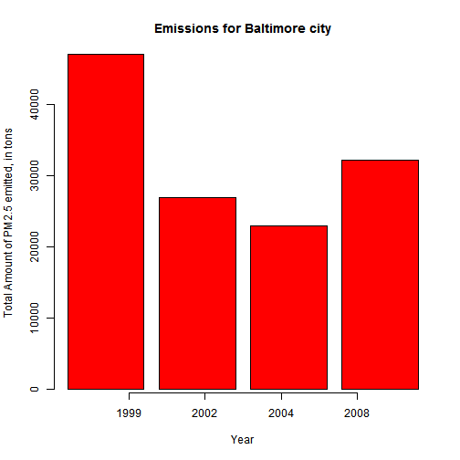
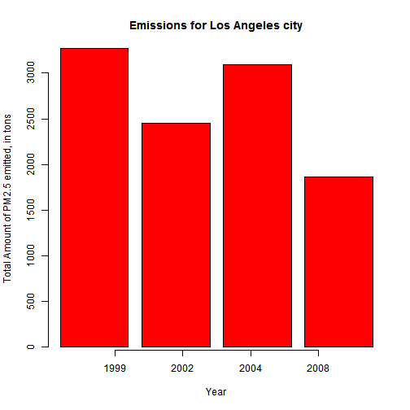

###Intro about the Data:

Fine particulate matter (PM2.5) is an ambient air pollutant for which there is strong evidence that it is harmful to human health. 

In the United States, the Environmental Protection Agency (EPA) is tasked with setting national ambient air quality standards for fine PM and for tracking the emissions of this pollutant into the atmosphere. Approximatly every 3 years, the EPA releases its database on emissions of PM2.5.

######Data was downloded from the 

url:"https://d396qusza40orc.cloudfront.net/exdata%2Fdata%2FNEI_data.zip".

##Question of Interest:

Have total emissions from PM2.5 decreased in the Baltimore City, Maryland (fips == "24510") and Los Angeles(fips="06037") from 1999 to 2008? 


```
##         fips      SCC Pollutant Emissions  type year
## 114288 24510 10100601  PM25-PRI     6.532 POINT 1999
## 114296 24510 10200601  PM25-PRI    78.880 POINT 1999
## 114300 24510 10200602  PM25-PRI     0.920 POINT 1999
```

--- .class #id 

####Code for the Shiny App:

```r
library(shiny)
shinyApp(
  ui=(
    fluidPage(    
      titlePanel(h3("Comparison of Total Emission from PM2.5 by City from 1999 to 2008")),
 sidebarLayout(         sidebarPanel(  selectInput("region", "Choose the City:", 
  choices=c("Baltimore","Los Angeles")) ),
    
mainPanel("Have total emissions from PM2.5 decreased in the Baltimore City, Maryland and Los Angeles from 1999 to 2008? " ,
"The overall total emisssion from Baltimore City and Los Angeles city has decreased from 1990 to 2008 (over 10 year period) ",
  plotOutput("Emissions"))))), 
                  
server=(function(input, output) {output$Emissions <- renderPlot({    if (input$region=="Baltimore"){barplot(height = c(47103.19,26968.79,22939.78,32135.48),                                                                                     main=input$region,                                                                col="red", y="Total Amount of PM2.5 emitted, in tons",                           xlab="Year")
axis(1,c(1:4),c(1999,2002,2004,2008))}
else if (input$region=="Los Angeles"){barplot(height=c(3274.180,2453.916,3091.354,1862.282),                main=input$region,col="red",                                                ylab="Total Amount of PM2.5 emitted, in tons",                                xlab="Year")
  axis(1,c(1:4),c(1999,2002,2004,2008))}  })})  )
```

<!--html_preserve--><iframe src="appb0084801cecfbc04f9f3d8a20eec14f1/?w=&amp;__subapp__=1" width="100%" height="400" class="shiny-frame"></iframe><!--/html_preserve-->

```r
runApp(app)
```

```
## Error in runApp(app): object 'app' not found
```

---
Disclamer: I tried running shiny app in slidify but it does not work somehow, tried to find materials on internet but was of no help. Thats why I am putting the plot manually.

When we input city as Baltimore: the plot looks like this
 

The total emissions for Baltimore city have decreased from 1999 to 2008

---
When we input city as Los Angeles: the plot looks like this
 
The overall emissions for Los Angeles city have decreased from 1999 to 2008

###Directives on how to visualize this Shiny application
THe shiny application can be viewed on this website
url:"https://shweta.shinyapps.io/Shinyapp"
  
---  
  


